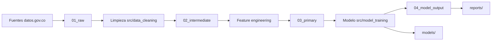

# Arquitectura del proyecto

## Diagrama de flujo

## Integración de fuentes

Describir aquí las fuentes de datos, APIs y proceso de consolidación.

## Componentes

| Módulo | Responsabilidad |
|--------|-----------------|
| `data_cleaning.py` | Limpieza y tratamiento de nulos/atípicos |
| `feature_engineering.py` | Variables derivadas y codificación |
| `pipeline_integration.py` | Unión de conjuntos de datos |
| `model_training.py` | Entrenamiento y tuning |
| `model_evaluation.py` | Métricas e insights |
